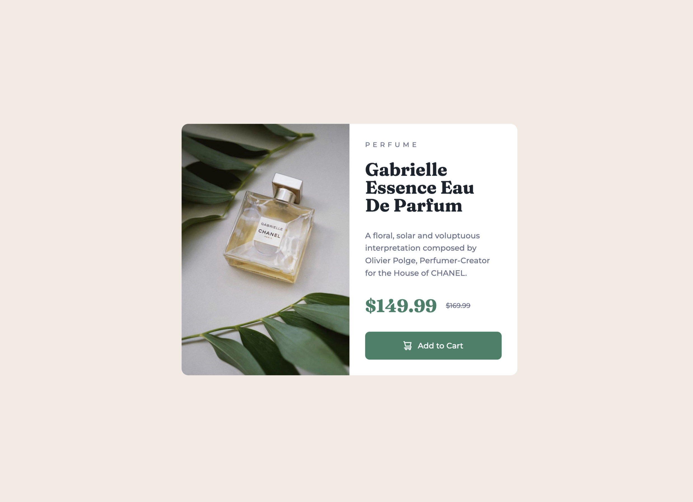

# Frontend Mentor - Product preview card component solution

This is a solution to the [Product preview card component challenge on Frontend Mentor](https://www.frontendmentor.io/challenges/product-preview-card-component-GO7UmttRfa).

## Table of contents
- [Frontend Mentor - Product preview card component solution](#frontend-mentor---product-preview-card-component-solution)
  - [Table of contents](#table-of-contents)
  - [Overview](#overview)
    - [The challenge](#the-challenge)
    - [Screenshots](#screenshots)
    - [Links](#links)
  - [My process](#my-process)
    - [Built with](#built-with)
    - [What I learned](#what-i-learned)
    - [Continued development](#continued-development)
    - [Useful resources](#useful-resources)
  - [Author](#author)

## Overview

### The challenge

Users should be able to:

- View the optimal layout depending on their device's screen size
- See hover and focus states for interactive elements

### Screenshots

Desktop


Mobile


### Links

- Solution URL: [Solution code on Github](https://github.com/mindful108/frontendmentor-product-preview-card-component.git)
- Live Site URL: [Live solution hosted on Github](https://mindful108.github.io/frontendmentor-product-preview-card-component/)

## My process

### Built with

- Semantic HTML5 markup
- CSS with custom properties (variables)
- Flexbox
- Mobile-first workflow
- Responsive "art-directed" images

### What I learned

I decided to use responsive images in the HTML to swap the mobile and desktop product photos, rather than show/hide them with CSS.

Here is the code I used in my solution.

```html
<picture>
  <source media="(max-width: 614px)" srcset="images/image-product-mobile.jpg" />
  <source
    media="(min-width: 615px)"
    srcset="images/image-product-desktop.jpg"
  />
  
</picture>
```
---

In my CSS I used global variables for the colors, even though it's probably overkill for a small project like this. 

I also leveraged a global variable to adjust the width of the headline and product description for screen widths between 375px and 615px (which is my desktop breakpoint). If I had applied it to the entire ```.card-content``` section then the button would have been affected as well and I wanted to keep that full width. 

At the top of my file:
```css
:root {
  --contentMaxWidth: 390px;
} 
```
I then added ```max-width: var(--contentMaxWidth);``` to the h2 and p selectors so I could tweak them both at the same time. It was good practice for leveraging global variable, even though I could have just created a single rule for both to (even more easily) tweak them in a single place:

``` css
h3, p {
  max-width: 390px;
}
```
---

A small addition I made was to replace all the specs in my attribution at bottom to non-breaking spaces ```&nbsp;``` so the sentence drops to a new line rather than awkwardly breaking at each word.

```html
Coded&nbsp;by&nbsp;<a href="https://judahlynn.com">Judah&nbsp;Lynn</a>.
```

### Continued development

I plan to do more Frontend Mentor projects to continue developing my speed and workflow using my own custom snippets and starter templates. I will also start to use Tailwind CSS and looking forward to incorporating React for more interactive challenges.

### Useful resources

[I used this MDN doc](https://developer.mozilla.org/en-US/docs/Learn/HTML/Multimedia_and_embedding/Responsive_images) as a refresher for incorporating responsive images.

 
## Author

- Website - [Judah Lynn](https://judahlynn.com)
- Frontend Mentor - [@mindful108](https://www.frontendmentor.io/profile/mindful108)
